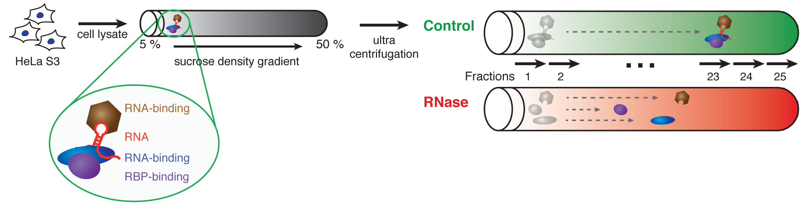
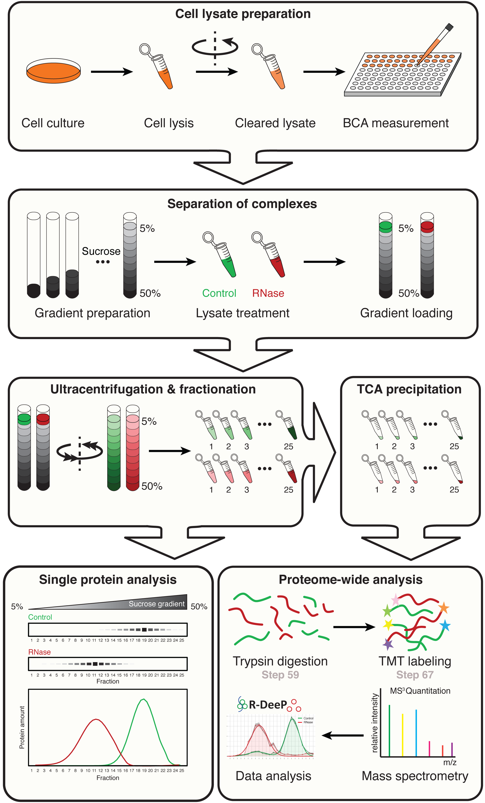
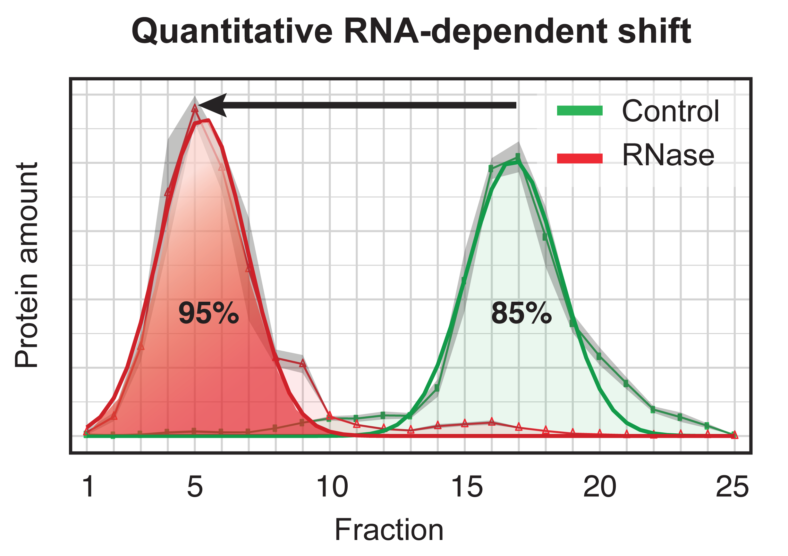

Supervisor: 

* Maïwen Caudron-Herger (m.caudron@dkfz.de)

<hr style="background-color: black;height: 1.0px;"/>

## Introduction

RNA is a versatile molecule that not only serves as a template for the production of proteins but also associates with proteins to form RNA–protein complexes that play key regulatory roles in various central cellular processes, including for example RNA metabolism and the regulation of gene expression. Therefore, analysis of RNA–protein complexes is essential to understanding the underlying molecular circuitry. In recent years, with the growing interest for **RNA-binding proteins (RBPs)** several proteome-wide studies have been dedicated to the identification of RBPs and their catalogization. As a result, the list of RBPs is growing and new RBPs are continuously discovered. This is in part due to the diversity of the techniques used - ranging from affinity purification involving modified oligo-nucleotides to phenol-chloroform based isolation - but also due to the difficulty to evaluate their respective specificity and sensitivity.  

In a recently published analysis, an orthogonal approach was applied, free of any pre-chemical treatment of the sample (e.g. incorporation of modified oligo-nucleotides), free of any affinity-based purification (e.g. pulldown of poly(A)-RNA molecules) and free of any enrichment procedure (e.g. aquous phase selection after phenol-chloroform phase separation). The concept of **RNA dependence (R-DeeP)**, which describes proteins and protein complexes whose interactions are directly or indirectly dependent on the presence of RNA, was translated into a **proteome-wide screen** to automatically identified RNA-dependent proteins.The R-DeeP protocol involves the ultracentrifugation of protein lysates on a sucrose gradient. After centrifugation, the gradient is fractionated into 25 fractions, which are analyzed per western blot for individual protein analysis, or per mass spectrometry for a proteome-wide analysis.  

The aim of this project is to automatically identify **RNA-dependent proteins** from the position of the proteins in an untreated cell lysate (control sample) as compared to an RNase-treated lysate (RNase sample). The R-DeeP screen comprises three replicates of each sample, for which 25 fractions are available.  

<div class="figure" style="text-align: center">

<p class="caption">Fig. 1 - R-DeeP principle</p>
</div>

In Fig. 1, The principle of the R-DeeP approach based on RNA dependence is depicted.  
<br>

<div class="figure" style="text-align: center">

<p class="caption">Fig. 2 - R-DeeP screen workflow</p>
</div>

In Fig. 2, the screen workflow is depicted showing the different steps of the protocol down to the acquisition of the mass spectrometry data.

Here, we will perform the analysis in R of the mass spectrometry dataset, which contains the amount of each protein (one protein per row) per fraction (2 samples x 25 fractions x 3 replicates = 150 columns). The amount of protein is given in arbitrary unit.

The 5 sub-projects correspond to different cell cycle states of HeLa or A549 cells:

> 1. sub-project 1: HeLa_NS = non-synchronized HeLa cells  
> 2. sub-project 2: HeLa_Mitosis = HeLa cells synchonized in mitosis  
> 3. sub-project 3: HeLa_Interphase = HeLa cells synchonized in interphase  
> 4. sub-prohect 4: A549_NS = non-synchronized A549 cells  
> 5. sub-project 5: Both HeLa_Mitosis and HeLa_Interphase (**IMPORTANT**: this sub-project is recommended for a group of students feeling comfortable with R programming and data analysis)  

<hr style="background-color: black;height: 1.0px;"/>

## Objective and workplan

The objective of this project is to **perform the analysis** of the mass spectrometry data to **automatically identify** the RNA-dependent proteins. This analysis will involve the following steps:

* **Description** of the dataset and evaluation of the reproducibility of the experiments

* **Normalization** of the data to facilitate the analysis and subsequent comparison between the samples

* Identification of **absolut and local maxima** (peaks) in the protein profiles (for each protein: distribution of its amount in the 25 fractions of each sample)

* Fit of the protein profiles (optional)

* **Comparison** of the position of the protein peaks in the control versus RNase-treated sample

* Definition of **selection criteria** for the selection of the RNA-dependent proteins

* Application of the defined criteria to automatically identify RNA-dependent proteins in the dataset.

* **Further analysis** of the RNA-dependent proteins and RNA-independent proteins

* Make a **coherent report** of your complete analysis and results using R markdown

<div class="figure" style="text-align: center">

<p class="caption">Fig. 3 - Quantitative analysis</p>
</div>

In Fig. 3, the result of the quantitative analysis of an examplary protein is depicted.

<hr style="background-color: black;height: 1.0px;"/>

## Description of the datasets

We have provided the datasets as CSV files.  
<span style="color:red">**IMPORTANT**: The provided datasets are in part unpublished data and should be treated **confidentially**! </span> 

Download the file from the DropBox folder:

* Dataset for the non-synchronized HeLa cells [R-DeeP_HeLa_NS](https://www.dropbox.com/scl/fi/rc2108mmasg0o6ohmreu2/RDeeP_HeLa_NS.csv?rlkey=5hdwymcqas9ihhyj9nkgj5z73&dl=0)  

* Dataset for the mitotic HeLa cells [R-DeeP_HeLa_Mitosis](https://www.dropbox.com/scl/fi/ymml03vygo5fpz91s8ieg/RDeeP_HeLa_Mitosis.csv?rlkey=hrs7v0mcnfl2stzluvf9jzeh1&dl=0)  

* Dataset for the interphasic HeLa cells [R-DeeP_HeLa_Interphase](https://www.dropbox.com/scl/fi/bapp6lvlcj4vsqy22jxfd/RDeeP_HeLa_Interphase.csv?rlkey=u4zcnzzoqp2daqfcthvijubtu&dl=0)  

* Dataset for the non-synchronized A549 cells [R-DeeP_A549_NS](https://www.dropbox.com/scl/fi/eh9kiwiqj62bqtdzwj1x2/RDeeP_A549_NS.csv?rlkey=pdbm6wd9zbdtomhek7nzahrsl&dl=0)  

Load the file as showed below for the non-synchronized HeLa cells (RDeeP_HeLa_NS.csv):
You need to indicate the path to the directory where you stored the dataset (.csv file) by replacing the **path/to/your/directory/** as shown below accordingly!

```{r eval=FALSE}
MS_Table <- read.table("path/to/your/directory/RDeeP_HeLa_NS.csv", header=TRUE, row.names=1, sep = ";")
# For example: 
# MS_Table <- read.table("~/Desktop/2024_Data_Analysis_Proteom/RDeeP_HeLa_NS.csv", header=TRUE, row.names=1, sep = ";")
```

Row names are protein names formatted as **Entry Name**. More detailed information about each protein can be obtained from the [Uniprot](https://www.uniprot.org) webpage.

```{r eval=FALSE}
head(rownames(MS_Table),12)
```

Columns indicate the respective fractions, from fraction 1 to fraction 25, for the twp samples (Control and RNase) and their replicates (Rep1, Rep2, Rep3).
For example, the column named **Fraction15_Ctrl_Rep3** corresponds to the fraction 15 of the control sample in the replicate 3.

```{r eval=FALSE}
head(colnames(MS_Table),12)
```

<hr style="background-color: black;height: 1.0px;"/>

## Literature review

#### Reviews 

Read these reviews to gain some understanding of RNA-binding proteins and their importance.

* [Sternburg et al., Global Approaches in Studying RNA-Binding Protein Interaction Networks, 2020, Trends in Biochemical Sciences](http://www.cell.com/trends/biochemical-sciences/retrieve/pii/S0968000420300633?_returnURL=https%3A%2F%2Flinkinghub.elsevier.com%2Fretrieve%2Fpii%2FS0968000420300633%3Fshowall%3Dtrue)

* [Corley et al., How RNA-Binding Proteins Interact with RNA: Molecules and Mechanisms, 2020, Molecular Cell](https://www.cell.com/molecular-cell/fulltext/S1097-2765(20)30159-3?_returnURL=https%3A%2F%2Flinkinghub.elsevier.com%2Fretrieve%2Fpii%2FS1097276520301593%3Fshowall%3Dtrue)

* [Gebauer et al., RNA-binding proteins in human genetic disease, 2020, Nature Reviews Genetics](https://www.nature.com/articles/s41576-020-00302-y)

#### Experimental methods

The original R-DeeP publication and its associated protocol can help you understanding the concept of RNA dependence and the analysis of the mass spectrometry data.

* [Caudron-Herger et al., R-DeeP: Proteome-wide and Quantitative Identification of RNA-Dependent Proteins by Density Gradient Ultracentrifugation, 2019, Molecular Cell](https://www.cell.com/molecular-cell/fulltext/S1097-2765(19)30310-7)

* [Caudron-Herger et al., Identification, quantification and bioinformatic analysis of RNA-dependent proteins by RNase treatment and density gradient ultracentrifugation using R-DeeP, 2020, Nature Protocols](https://www.nature.com/articles/s41596-019-0261-4)

#### Helpful databases

The following databases can help you to deepen your analysis of the dataset.

* [Uniprot](https://www.uniprot.org)

* [R-DeeP](http://r-deep.dkfz.de)

* [RBP2GO](https://rbp2go.dkfz.de)

* [CORUM](http://mips.helmholtz-muenchen.de/corum/)

* [STRING](https://string-db.org)

* [The Gene Ontology Resource](http://geneontology.org)

<hr style="background-color: black;height: 1.0px;"/>

## How to structure your project

### Project proposal

You first task will be to define a **project proposal**, which should include:

>* list of planned analysis steps
>* milestones (important achievements)
>* deliverables (what kind of result will I produce for each milestone)?
>* approximate timetable

You will present this project proposal together with a literature review on the subject 3 week after the begining of the semester (10 minutes presentation + 5 minutes discussion). 

### Project 

You project **MUST** contain the following elements:

>* *descriptive statistics* about the datasets, including *graphical representations*  
>* a *dimension reduction* analysis (PCA, clustering or k-means)  
>* *statistical tests* (t-test, proportion tests,...)  
>* a *linear regression* analysis, either uni- or multivariate  

#### Data cleanup

You will be analyzing multiple proteomic datasets together (2 samples, 3 replicates each). It is essential that you explore each dataset and clean it. Cleaning can refer to many things:

* Removing missing values
* Imputing missing values
* Removing low variance columns/rows
* Removing batch effects
* Removing outlier samples (only if it is due to technical issues !!)
* Making sure that data is in the correct format, for example, numbers should be encoded as numeric and not as characters. Categorical variables should be factors etc.
* Re-ordering rows/columns in meaningful and useful ways

#### Data exploration

Now that you have cleaned data, explore your data to understand its structure. Perform basic exploratory data analysis.

* Look at the distribution of the overall data, specific samples or features.
* Visualize the data distribution
* Visualize the inter-dependencies among specific samples/features of interest
* Check some of your hypothesis like - is something high/low between two conditions etc

#### Data reduction

You have a high dimension matrix, that is, you have way more features (~5000 proteins) than observations (~150 fractions).

* Try out methods to reduce the dimensionality of this data. 
* Cluster your samples to identify similar and dis-similar groups
* Check how well the groups separate based on the features of your interest

#### Data modelling

For example, by using **complementary information** from databases on RNA-binding proteins, gene ontology or protein-protein interactions, try to *predict* whether a protein is a **TRUE** RNA-dependent protein. Test how well this could work.

<br>
<hr style="background-color: black;height: 1.0px;"/>

Maïwen Caudron-Herger, m.caudron@dkfz.de
<br>
<br>
